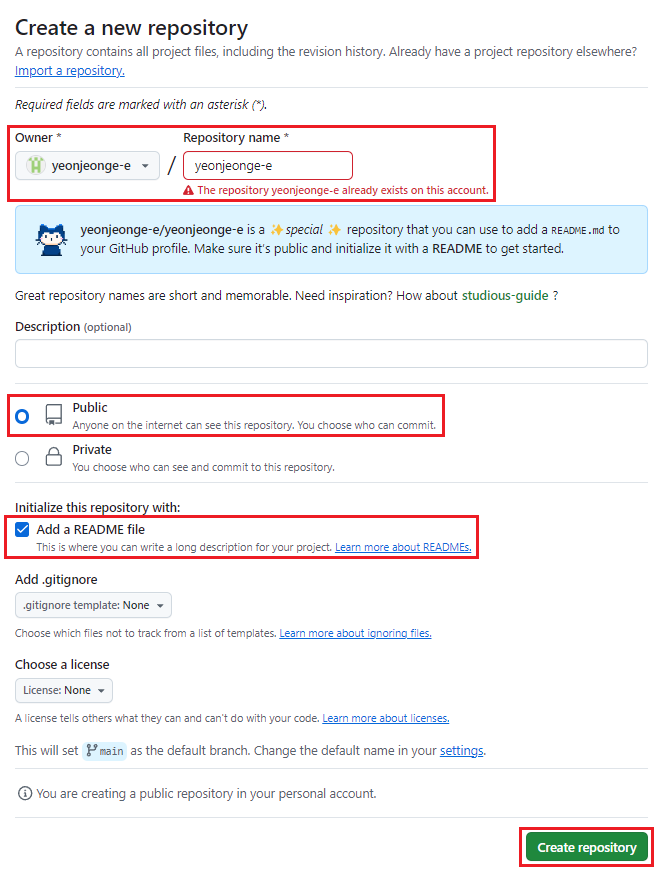
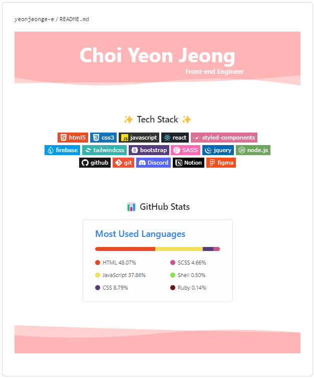

> 많은 개발자들이 Github를 사용하는 만큼 프로필 페이지도 다양하게 꾸며져 있다. 사람들 github 구경만 하다가 내 프로필도 꾸며보자! 하며 글을 작성해본다.
 
 
>이 글과 이모티콘은 [Git 공식문서](https://docs.github.com/en/account-and-profile/setting-up-and-managing-your-github-profile/customizing-your-profile/managing-your-profile-readme)와 [emoji-cheat-sheet](https://www.webfx.com/tools/emoji-cheat-sheet/)를 참고하여 작성하였다. 

 

### 1. Repository 만들기

✔ 자신의 깃허브 아이디와 **동일한 아이디**로 Repository를 생성 
✔ 저장소는 **공개** 로 설정 
✔ **Add a README file** 체크 
✔ **Create repository** 클릭하여 생성 

 

### 2. README 파일 작성하기

✔ 생성된 README.md 파일을 연필모양 아이콘 클릭하여 수정하기 
✔ **Edit** 페이지에서 [Markdown](https://docs.github.com/ko/get-started/writing-on-github/getting-started-with-writing-and-formatting-on-github/basic-writing-and-formatting-syntax)으로 작성하면 **Preview** 페이지에서 바로 결과를 보여준다.
  

#### ✨ 본격적으로 프로필을 꾸며보자 ✨ 
1. `Header & Footer` 
👉 capsule-render 
https://github.com/kyechan99/capsule-render  

2. `Tech Stack` 
👉 벳지 제작 사이트 
https://shields.io/ 

    👉 로고 사이트 
    https://simpleicons.org/  

3. `GitHub Stats & Top Languages Card` 
👉 github-readme-stats 
https://github.com/anuraghazra/github-readme-stats  

4. `방문자 수 (Hits)` 
👉 Hits 
https://hits.seeyoufarm.com/  

5. `daily 코딩 시간 기록` 
👉 productive-box 
https://github.com/techinpark/productive-box

 

### 3. README 파일 저장하기

✔ 프로필 수정 후 우측 상단에 위치한 **Commit change** 버튼을 누르면 변경된 사항이 반영된다.  
